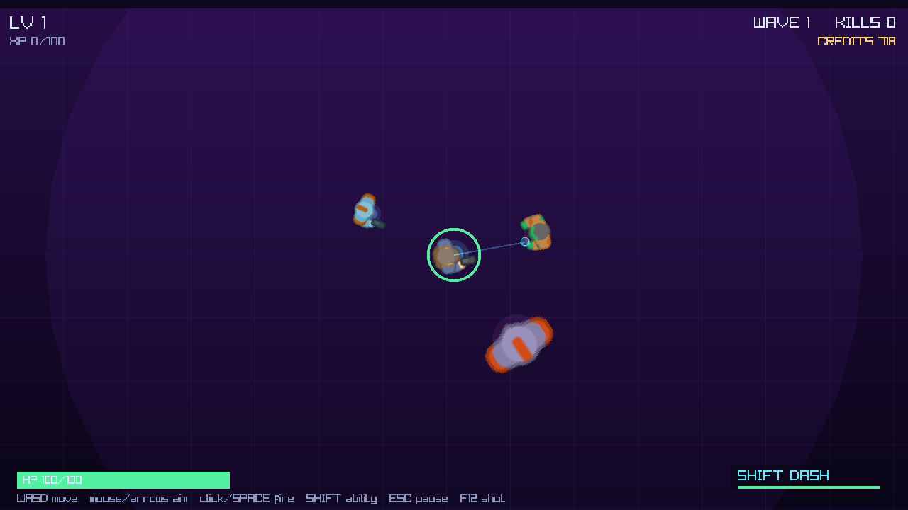

# CoreShift: Chrono-Survival

A 2D top-down roguelike survival game (DCIT 318 semester project). The player fights
increasingly difficult waves of enemies, levels up, and picks randomized upgrades; currency
persists between runs for permanent progression.

This repository holds the **engine-agnostic game core** so all gameplay logic can be built and
tested without the Unity Editor. Unity later becomes a thin rendering/input adapter.

## Architecture

```
CoreShift.Core   pure C# simulation (no Unity, no I/O)
CoreShift.Data   content definitions + JSON/XML saves
CoreShift.Game   Raylib-cs graphical game app (neon vector style)
CoreShift.Console headless runner + benchmark
CoreShift.Core.Tests  xUnit tests
CoreShift.Unity  Unity adapter scripts (compiled only inside Unity)
```

Dependencies point inward: Console and Unity depend on Core/Data, never the reverse. All game
rules live in `CoreShift.Core`.

## Prerequisites

- .NET SDK 10.0 or newer (`dotnet --version`)

## Build and test

```bash
cd CoreShift
dotnet build CoreShift.slnx
dotnet test
```

## Play (graphical app)

```bash
dotnet run --project src/CoreShift.Game
```

A real windowed game: main menu, Progression Hub, a **follow-camera** neon twin-stick view with
**animated character sprites** (player gunner, zombie/robot enemies), manual aiming, status
effects, crits, knockback, particles and screen shake, level-up upgrade cards, pause, and a
game-over screen. Screenshot frames:



Character sprites are from Kenney's CC0 "Topdown Shooter" pack — see `assets/ATTRIBUTION.md`.
All other visuals and audio are generated procedurally.

**Controls:** WASD to move (normalized diagonals, smooth acceleration), **mouse or arrow keys to
aim**, **click / hold Space to fire**, **Shift for the active ability** (dash or Chrono time-slow),
Esc to pause, 1–3 or arrows + Enter to choose an upgrade, F12 to save a screenshot. **Gamepad
supported** (left stick move, right stick aim, A/RT fire, LB ability). Optional **aim assist**
(Settings). Enemies drop health orbs and credits that the player magnetizes in; weapons (blaster,
shotgun, laser), status effects, crits, and a Settings screen (volume, screen shake, aim assist,
FPS) are available. Progress, settings, and unlocks save automatically to `saves/progress.json`
next to the executable.

Capture a scene to a PNG without a visible window:

```bash
dotnet run --project src/CoreShift.Game -- --screenshot shots/play.png --scene play --ticks 1200
# scenes: menu, hub, settings, play, levelup, gameover, status, enemies, aimtest
```

## Play (headless, scripted)

```bash
dotnet run --project src/CoreShift.Console -- --auto --ticks 1800
```

## Play (interactive)

```bash
dotnet run --project src/CoreShift.Console
```

WASD / arrow keys to move, Esc to quit.

## Benchmark

```bash
dotnet run --project src/CoreShift.Console -- --bench
```

Prints average and p95 tick time and entities/second at 256, 512, 1024, and 2048 concurrent
enemies. This is the measurable evidence for the proposal's performance goal.

## Platforms, installers, and save location

CI (`.github/workflows/release.yml`) builds, on a version tag, self-contained packages for:

| Platform | Artifacts |
|---|---|
| Windows | `.msi` installer and portable `.zip` (win-x64) |
| Linux | `.tar.gz`, `.deb` (amd64), `.rpm` (x86_64) |
| macOS | `.dmg` and `.zip` app bundles for **Apple Silicon** (osx-arm64) and **Intel** (osx-x64) |

Artifacts are published to the public builds repository:
<https://github.com/niicommey01/coreshift-builds/releases>

**Saves and screenshots are written to a per-user data directory** (never next to the executable,
which is read-only when installed):

- Windows: `%APPDATA%\CoreShift\`
- macOS: `~/Library/Application Support/CoreShift/`
- Linux: `$XDG_DATA_HOME/CoreShift/` or `~/.local/share/CoreShift/`

**macOS note:** builds are ad-hoc signed, not notarized. On first launch, right-click the app and
choose **Open**, or clear the quarantine flag:

```bash
xattr -dr com.apple.quarantine /Applications/CoreShift.app
```

Full Gatekeeper-free distribution requires an Apple Developer ID certificate and notarization.

## Key design points

- **Fixed timestep** 60 Hz simulation (`World.FixedDeltaSeconds`) for frame-rate independence.
- **Deterministic RNG** (`DeterministicRng`) seeded per run so runs are reproducible and testable.
- **Manual twin-stick combat** — WASD move, arrows aim, hold Space to fire (never auto-targets),
  with an on-player aim indicator and forward reticle.
- **Procedural audio** — synthesized SFX and a looping music track (no audio assets).
- **Progression** — pick a starting character (Scout/Bruiser/Techno), spend credits in the
  Progression Hub, and see a local leaderboard of your best runs.
- **Upgrade depth** — reroll and banish offers on level-up; blaster/shotgun/laser weapons.
- **Presentation** — parallax starfield, follow camera, humanoid sprites, scene fades, screen
  shake, hit-stop, floating damage numbers, low-health vignette, off-screen enemy indicators.
- **Endless waves** with scaling difficulty.
- **Status effects** — Burn, Poison, Slow, Shock, Stun, applied by weapons and enemy contact.
- **Crits, knockback, and damage/heal events** driving floating numbers and hit-stop.
- **Magnet pickups** — health orbs and credits dropped by enemies and pulled in by `PickupRadius`.
- **Object pooling** for enemies, projectiles, and pickups, with capacity caps and drop counting.
- **Zero-allocation hot path** — allocation-free struct-enumerable ECS iteration; a test asserts
  ~0 bytes allocated per simulation tick.
- **Runtime tuning** — invariant globalization, workstation non-concurrent GC, and diagnostics /
  EventSource disabled to cut memory, threads, and startup cost.
- **Crash diagnostics** — startup failures and unhandled exceptions are written to a log in the
  per-user data directory (`logs/crash-*.log`) instead of dying silently.
- **Spatial hash grid** for broad-phase collision, reducing O(n^2) checks to roughly O(n).
- **Data-driven content** in `content/*.json` (enemies, upgrades, waves).
- **Both JSON and XML saves** behind `ISaveStore`, with schema versioning.

## Repository layout

```
CoreShift/
  CoreShift.slnx
  assets/                      character sprites (CC0) + ATTRIBUTION.md
  content/                     enemies.json, upgrades.json, waves.json
  shots/                       verification screenshots (menu, play, levelup, hub, gameover)
  docs/superpowers/specs/      design documents
  docs/superpowers/plans/      implementation plans
  src/CoreShift.Core/          simulation
  src/CoreShift.Data/          content + serialization + composition root
  src/CoreShift.Game/          Raylib-cs graphical app
  src/CoreShift.Console/       headless runner + benchmark
  src/CoreShift.Unity/         Unity adapter (not built here)
  tests/CoreShift.Core.Tests/  xUnit tests
```

## Team role mapping

| Member | Role | Owns |
|---|---|---|
| Fenuku Reynolds Elikem | Project Manager | Milestones, schedule, risk log |
| Commey Jude Nii Klemesu | Business Analyst | `content/*.json`, balance, traceability |
| Ampadu Samuel Amoako | UI/UX Designer | HUD, menu, hub, pause/game-over specs |
| Mensah Constance Awuradwoa | Frontend Developer | Console presentation, Unity rendering |
| Ohemeng Yvonne Darkoa | Frontend Developer | Unity input/animation, HUD binding |
| Poku Janelle Nana Yaa | Backend Developer | Movement, combat, wave systems |
| Nutsua Bless Yesutor | Backend Developer | Upgrades, progression, enemy AI |
| Amoah Kwame Adjei | Database Administrator | Save schema, versioning, integrity |
| Nelly Amewu | API Developer | `ISaveStore`, content-loading interfaces |
| Dominic Fatonade | QA/Test Engineer | Test suite, benchmark harness, triage |
| Dartey Natasha Armahbea | Documentation Lead | Design doc, README, final report |
| Darline Konadu Amoafo | DevOps & Deployment Lead | Build config, CI, releases |

## Documents

- Core design: `docs/superpowers/specs/2026-09-19-coreshift-chrono-survival-design.md`
- Core plan: `docs/superpowers/plans/2026-09-19-coreshift-core-implementation.md`
- Graphical app design: `docs/superpowers/specs/2026-09-19-coreshift-graphical-app-design.md`
- Graphical app plan: `docs/superpowers/plans/2026-09-19-coreshift-graphical-app.md`
